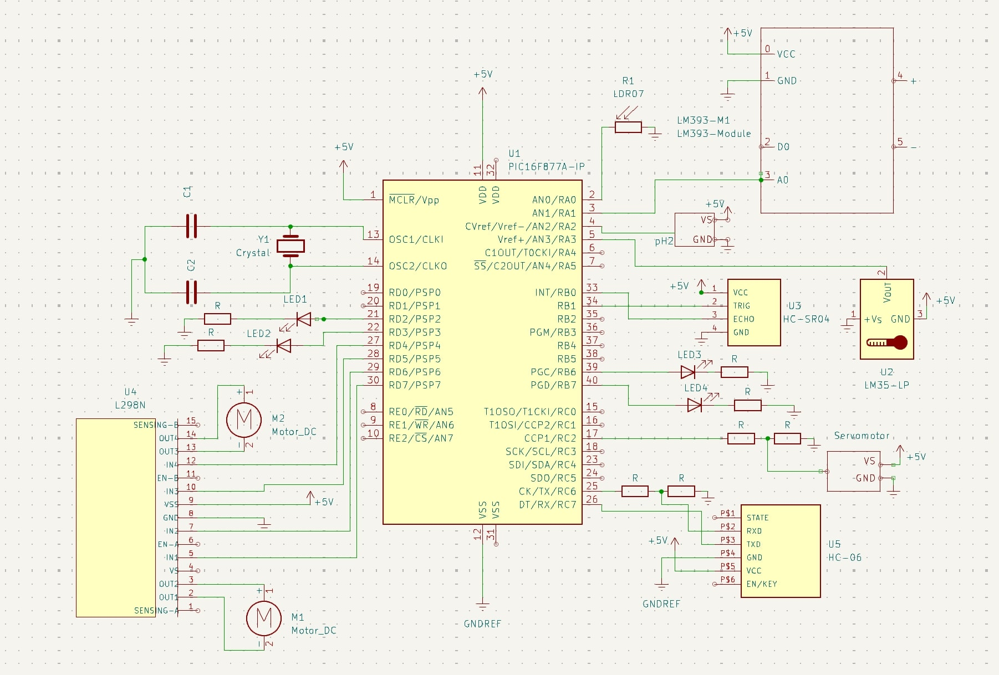

# IoT Enabled Agricultural Car
Welcome to the IoT Enabled Agricultural Car page. This repository houses the source code and documentation for our system. The car is owered by the PIC16F877A microcontroller. What sets our system apart is the fact that it is IoT-enabled, this allows users to monitor and control the system without being physically there. This is achieved by the smart use of Python scripts that let the host PC act as a middle node. The PIC16F877A collects data from sensors, then that data is sent to the PC via bluetooth. That data is then sent to an online platform to be displayed on a dashboard. This will help farmers track the environment of their land remotely, this is extremely useful for them and would save them alot of time and money. The repository includes the PIC16F877A source code, hardware specifications, and documentation. 

  

# Table of Contents
- [Requirements](#requirements)
- [Hardware Setup](#hardware-setup)
- [Software Setup](#software-setup)
- [Explaination of Codes and Scripts](#Explaination-of-Code-and-Scripts)
- [Other](#Other)
# Requirements
- PIC16F877A microcontroller
- Ultrasonic Distance Sensor
- PH Sensor
- Soil Moisture Sensor
- Temperature Sensor
- LEDs
- 4 DC Motors
- Servo Motor
- Motor Driver (H-Bridge)
- Bluetooth HC-06
- CRYSTAL Oscillator (8 MHz)
- 12V Battery
- 5V Battery

# Hardware Setup

# Software Setup
All the codes and scripts for this project can be found on this GitHub page. 

# Explaination of Code and Scripts

## PIC16F877A Code
The code for the PIC consists of multiple functions that work independently ensuring no clashes occur. Every peripheral is read from a seperate function, and every actuator is controlled by a seperate function. There are functions that make UART communication possible so the PIC can communicate with the PC via bluetooth. 

The PIC code keeps listeining on an open port, when a specific command is received an action is taken. There is a command that requests data from the PIC, then the data is sent to the PC in CSV format. 

## Python Script
We wrote two python scripts, one works on Windows and the other works on Unix based machines. The script works as follows:
1) A connection is established with the bluetooth module.
2) Credintials for the ThingSpeak platform are defined.
3) A simple UI is initialised to control the PIC.
4) A specific command that requests data from the PIC every 2 seconds.
5) When data is recieved from the PIC as a CSV, it is processed and turned into JSON format.
6) The JSON data is then sent to ThingSpeak to be displayed.
7) The python code also allows for the PIC to be controlled by the host device's keyboard.

## Bash Script
The bash script attached will create a virtual environment, install the necessary dependancies, and activate the virtual environment. Once it is ran the python script can be used without any issues.

# Other
- Youtube Link: [Video](https://youtu.be/1dOM5fpYLpE?si=kVBcAm1XXoWLi0Nx)
- GitHub Link: [Here](https://youtu.be/1dOM5fpYLpE?si=kVBcAm1XXoWLi0Nx)
- Our Report : [Report](EmbeddedProjectReport.pdf)
- Our Poster : [Poster](Embedded_Project_Poster)
